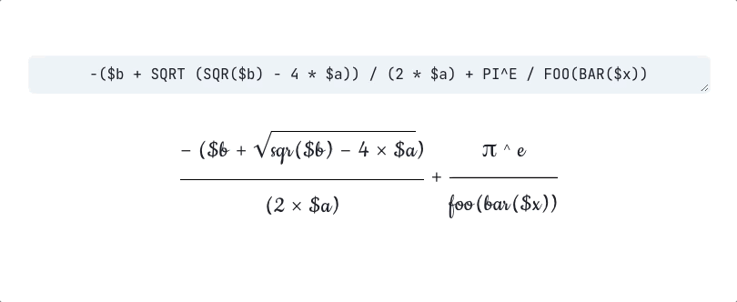

# Mathstylus

Mathematical formula visualizer.



## Getting Started

Install dependencies:

```shell script
yarn install
```

Run for development:

```shell script
yarn start
```

## Licensing

Mathstylus is released under [The MIT License](./LICENSE.md).

When contributing to Mathstylus, you can find the relevant license in the comments at the top of each file.
